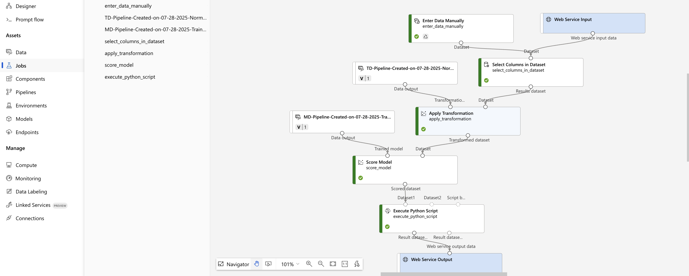
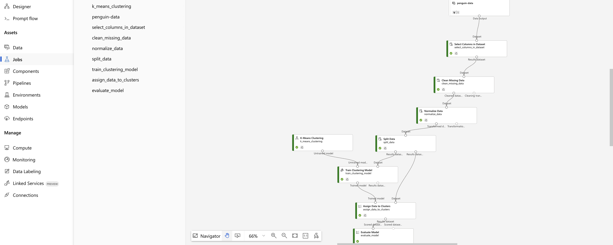

# ☁️ Azure Machine Learning — Practical Work

I worked in an **Azure ML workspace** (with preconfigured storage and compute) to build and run machine learning pipelines.  
Pipelines were primarily created using the **Azure ML Designer** interface, for data preparation, training, and evaluation.  
This work was part of my self-study in the **Microsoft Azure Machine Learning for Data Scientists** learning path, which introduced the essentials of Azure ML workflows.

---

## 🔧 Environment & Resources

- created an **workspace**, with blob storage and a CPU cluster for training/inference.  
- Pipelines were authored in **Azure ML Designer**, focusing on clarity and reproducibility.  
- Runs were tracked in **Experiments**, with metrics and outputs stored automatically.  

---

## 📚 Datasets

Three tabular datasets were used to practice supervised and unsupervised workflows.  
Each dataset was uploaded and referenced in multiple experiments.  

- **Automobile price** (regression): predicting numeric price from mixed features.  
- **Diabetes** (classification): predicting binary outcome with medical predictors.  
- **Penguins** (clustering): unlabeled dataset segmented with K-Means.  

---

## 1) Regression — Automobile Price Prediction

Predicted vehicle price using a tree-based regressor.  
The pipeline captured the flow from ingestion to evaluation, with Web Service I/O blocks included for deployment readiness.

**Key steps**  
- Preprocessing: select columns, normalize features.  
- Modeling: tuned tree-based regressor; cross-checked with AutoML.  
- Evaluation: RMSE/MAE/R² logged per run.  

---

## 2) Classification — Diabetes Risk

Built a classification pipeline to predict diabetes risk.  
Several runs were performed, including debugging and reruns to ensure reproducibility.

**Key steps**  
- Preprocessing: handle missing values, normalize, encode categorical features.  
- Modeling: logistic regression and gradient boosting.  
- Evaluation: AUC, F1, precision/recall logged and compared across runs.  

---

## 3) Clustering — Penguins (K-Means)

Segmented observations in an unsupervised setting to validate cluster structure.

**Key steps**  
- Preprocessing: select columns, clean missing values, normalize.  
- Modeling: K-Means with silhouette scoring; tested different k values.  
- Evaluation: cluster sizes and centroids exported for profiling.  

---

## 🤖 Automated ML — Baselines

Ran AutoML experiments for regression and classification to compare with manual pipelines.

**Key steps**  
- Benchmarked metrics such as AUC and RMSE.  
- Reviewed preprocessing defaults suggested by AutoML.  
- Used results to guide manual pipeline adjustments.  

---

## 📈 Tracking & Reproducibility

Azure ML automatically logged metrics, parameters, and outputs for each run.  
Failed runs were preserved, helping document the process and debugging steps.  

---

# Screenshots

   
  <em>Automobile price regression — real-time inference</em>

  
   <em>Diabetes classification — Designer flow</em>

  
   <em>Penguins clustering — Designer flow</em>

