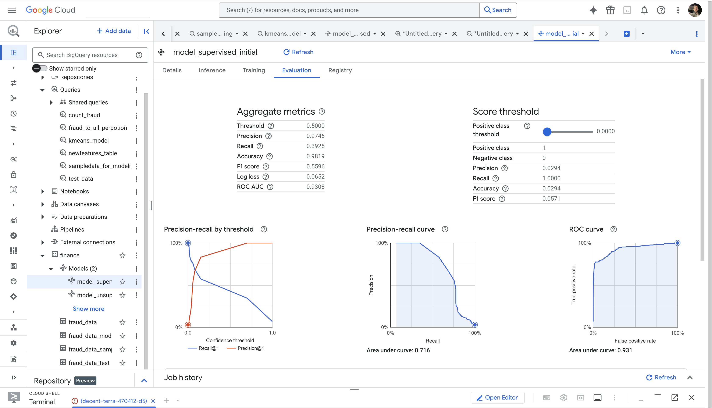

# 💳 Fraud Detection with Machine Learning on Google Cloud

## 📌 Overview
This project was completed as part of a **Google Cloud Skills Boost lab**.  
The objective was to detect fraudulent financial transactions using **machine learning on Google Cloud Platform (GCP)** with both **supervised** and **unsupervised** approaches.

The dataset (≈228k transactions, originally from Kaggle) contains transaction type, amount, origin/destination balances, and a fraud label (`isFraud`).  
The challenge is highly imbalanced (fraud <1%), typical of **real-world fraud detection**.

---

## ⚙️ Workflow

1. **Data Engineering & Exploration**
   - Ingested raw CSV into **BigQuery** via Cloud Storage.
   - Explored data distributions (fraud by type, transaction imbalances).
   - Identified that fraud mainly occurs in `TRANSFER` and `CASH_OUT`.

2. **Feature Engineering**
   - Created new features (`origZeroFlag`, `destZeroFlag`, `amountError`) to capture abnormal balance behaviors.
   - Applied undersampling to reduce class imbalance.
   - Partitioned into `train`, `validate`, and `test` datasets (~20% test holdout).

3. **Modeling**
   - **Unsupervised:** Trained **k-means clustering** for anomaly detection, profiled clusters with high fraud density.  
   - **Supervised:**  
     - Logistic Regression (baseline)  
     - Boosted Tree Classifier (gradient boosting) → selected **champion model**.

4. **Evaluation**
   - Compared models using **precision, recall, F1 score, accuracy, ROC/AUC**.
   - Boosted Trees outperformed logistic regression with higher AUC and better fraud recall.  
   - Fraud detection event rate increased by **>95%** compared to raw test data.

5. **Prediction**
   - Deployed champion model in **BigQuery ML**.
   - Scored test dataset, predicting fraudulent transactions with probability thresholds.

---

## 📊 Tech Stack

- **Cloud Platform:** Google Cloud Platform (BigQuery, Cloud Storage, Vertex AI)  
- **Languages:** SQL, Python  
- **ML Methods:** Logistic Regression · Boosted Trees · k-means clustering  
- **Concepts:** Class imbalance handling · Feature engineering · Fraud/Anomaly detection  

---

## 📊 Model Training & Evaluation

During this project, I trained supervised models in **BigQuery ML** to detect fraudulent transactions.  
The evaluation metrics and curves below illustrate model performance:

  
   <em>Evaluation of logistic regression classifier in BigQuery ML</em>

### Key Metrics
- **Accuracy:** 98.2%  
- **ROC AUC:** 0.93 (strong discriminatory power)  
- **Precision:** 97.5% (very low false positives)  
- **Recall:** 39.3% (fraud cases are rare, challenging to capture all)  
- **F1 Score:** 0.56 (balanced trade-off between precision & recall)

### Visual Insights
- **Precision-Recall by Threshold:** shows trade-off when adjusting probability cutoffs.  
- **Precision-Recall Curve:** confirms high precision, recall drops due to class imbalance.  
- **ROC Curve:** area under curve = 0.93, indicating robust fraud detection capability.
---

## 📂 Code Snippets

- [Data Preparation and feature engineering](https://github.com/returnkeys/data-science-portfolio/blob/main/projects/fraud-detection-ml/codes/data_preparation.sql) 
- [Train an unsupervised model to detect anomalies](https://github.com/returnkeys/data-science-portfolio/blob/main/projects/fraud-detection-ml/codes/unsup_kmean.sql) 

---
## 📝 Skills Gained

- Cloud-native ML workflows with **BigQuery ML**  
- Handling **imbalanced datasets** in fraud detection  
- **Unsupervised anomaly detection** vs **supervised classification**  
- Model benchmarking with AUC, precision/recall, and confusion matrices  
- End-to-end ML pipeline deployment on **Google Cloud**  