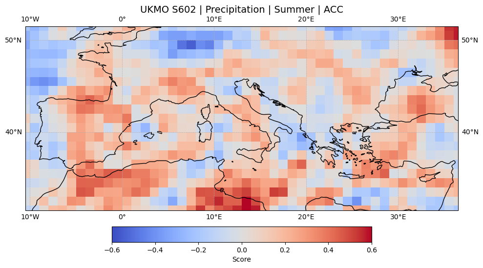

# 🌍 Seasonal Forecast Models Evaluation Pipeline

**Author:** Esmaeil Pourjavad  
**Domain:** Data Science | Predictive Modeling | MLOps | Satellite Data  

---

## 📌 Project Overview
This work is part of **Sphere**, a large European project on water availability and climate prediction.  
Here I present **only my contribution**: the design and implementation of a **seasonal forecast evaluation pipeline**.  

The project delivers an **end-to-end data science workflow** for evaluating and benchmarking predictive models at scale.  
Although applied to **seasonal climate forecasts** (Copernicus C3S multi-model datasets, 1993–2015), the pipeline’s design, tooling, and methodology are **generalizable to domains like finance, insurance, and risk analytics**.  

The workflow operationalizes the full lifecycle:  
**data ingestion → preprocessing → feature engineering → model evaluation → visualization & reporting**,  
providing **reproducible, automated, and scalable analytics** for decision-making under uncertainty.  

---

## ⚙️ Pipeline Components

### 1️⃣ Data Acquisition & Orchestration
- Automated ingestion of multi-model forecast data via **API clients** (`cdsapi`)  
- Batch workflows orchestrated with **Bash + Slurm** on HPC clusters  
- Integrated validation, error handling, and logging  
- Storage in standardized **NetCDF**  

**Keywords:** ETL pipelines · workflow orchestration · API integration · HPC scaling  

---

### 2️⃣ Data Preprocessing & Feature Engineering
- Harmonized datasets with **xarray, NumPy, CDO**  
- Regridding, normalization, resampling, detrending  
- Derived predictors (e.g., wind speed, anomalies)  
- Baselines and anomaly features for ML models  

**Keywords:** data wrangling · anomaly detection · feature engineering  

---

### 3️⃣ Model Evaluation Framework
- **Brier Skill Score (BSS):** categorical probabilistic accuracy
- **Continuous Ranked Probability Skill Score (CRPSS):** distribution accuracy
- **Area Under the ROC Curve (AUC):** discrimination ability 
- **Anomaly Correlation Coefficient (ACC):** deterministic forecast–observation correlation  

Framework implemented in **Python (xarray, NumPy), R** for multi-model benchmarking.  

**Keywords:** benchmarking · probabilistic forecasting · automated validation  

---

### 4️⃣ Visualization & Reporting
- Geospatial maps (**Cartopy + Matplotlib**)  
- Comparative **boxplots & heatmaps** (Seaborn)  
- Dashboards for decision support & scientific communication  
- Publication-ready outputs (reports, posters, dashboards)  

**Keywords:** geospatial visualization · statistical dashboards  

---

## 📊 Tech Stack
- **Languages:** Python, Bash  
- **Libraries:** xarray · NumPy · pandas · matplotlib · seaborn · cartopy · cdsapi  
- **Tools:** CDO (Climate Data Operators), Slurm (HPC orchestration)  
- **Data:** Seasonal forecasts (ECMWF, CMCC, DWD, MF, UKMO) + ERA5 reanalysis  
- **Environment:** Linux HPC cluster, NetCDF workflows  

---

## 📊 Example Results
Some outputs from the evaluation pipeline:

---

## 📂 Code Snippets
- [`data_preprocessing.sh`](code/data_preprocessing.sh) → harmonization & anomaly computation  
- [`model_evaluation.py`](code/model_evaluation.py) → skill score calculations  
- [`visualization.py`](code/visualization.py) → geospatial & statistical plots  

*(Full pipeline code is maintained privately due to project restrictions; here are representative excerpts.)*

---

## 🔑 Data Science Relevance
- **Data Engineering** → scalable ingestion, ETL pipelines, heterogeneous data harmonization  
- **Feature Engineering** → anomalies, derived predictors  
- **Model Evaluation** → probabilistic/deterministic metrics, reproducible benchmarking  
- **Visualization** → dashboards, publication-ready figures  
- **Scalability & Reproducibility** → HPC orchestration, modular design, logging  

Applicable beyond climate science → **insurance, finance, risk scoring, fraud/anomaly detection**.  

---

## 🎤 Conferences & Publications
- **Conference Presentation:**  
  *EGU 2025* — *Assessing the skill of Copernicus seasonal forecast systems in predicting temperature and precipitation anomalies in the Alpine region*  

- **Publication:**  
  *Springer Nature – Climate Dynamics* (final preparation phase)  

---

## 🚀 Next Steps
- **Deployment & Inference** → real-time monitoring of forecasts  
- **Dashboards** → stakeholder-friendly interfaces  
- **Knowledge Transfer** → performance bulletins & training  

**Keywords:** deployment pipelines · real-time inference · stakeholder engagement

---

## 📬 Contact
Interested in applications of **data science, predictive modeling, or MLOps pipelines** in climate, insurance, or finance?  
📎 [LinkedIn](https://www.linkedin.com/in/esmaeil-pourjavad-091b861b3)  

